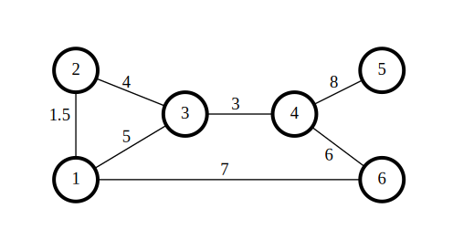

CycleSampler
============

The `cyclesampler` R-package is an implementation of property-preserving Markov Chain Monte Carlo method for generating surrogate networks in which (i) edge weights are constrained to an  interval and vertex weights are preserved exactly, and (ii) edge and  vertex weights are both constrained to intervals.

Please see the following article for details and discussion of the algorithm:

> Kai Puolamäki, Andreas Henelius, Antti Ukkonen. Randomization algorithms for large sparse networks.
> Physical Review E 99, 053311, 2019. <https://doi.org/10.1103/PhysRevE.99.053311>


Installation
-------------
To install this R-package, proceed as follows.

First install the `devtools`-package and load it in R:
```R
install.packages("devtools")
library(devtools)
```

Then install the `cyclesampler` package

```R
install_github("edahelsinki/cyclesampler")
```

Loading
-------------
After installation, start R and load the package using
```R
library(cyclesampler)
```

Usage
-------------
Here is a brief example of how to use this R-package to create surrogate networks. Consider the following network, which could describe phone calls between different individuals. Each node is a person and the edge weight between each node represents the total phone call duration (in hours) between the two persons connected by the edge. In this network both edge and node weights are hence bounded by the constraint that no-one can spend more than 24 hours on the phone per day.


We now generate surrogate networks where the node weights are preserved exactly, but where the edge weights can vary on the interval [0, 24].

```R
library(cyclesampler)
library(xtable)

## Define the network
data <- matrix(c(1, 2, 1.5,
                 1, 3, 5,
                 1, 6, 7,
                 2, 3, 4,
                 3, 4, 3,
                 4, 5, 8,
                 4, 6, 6),
               byrow = TRUE, ncol = 3)

## Scale edge weights to the interval [0, 1] correponding to the interval [0, 24] hours.
data[, 3] <- data[, 3] / 24

## Set constraints on the edge weights: they must be on the interval [0, 24] hours
a <- rep(0, 7)
b <- rep(1, 7)

## Initialise the CycleSampler
X <- cyclesampler(data, a = a, b = b)

## Run the sampler for 5000 steps and pick a sample, repeat five times
set.seed(42)
res <- replicate(5, {X$samplecycles2(5000) ; X$getstate()})

## Table with edge weights
w_e           <- cbind(data[,3], res) * 24
colnames(w_e) <- c("original", paste0("sample ", seq.int(5)))
rownames(w_e) <- paste0("edge ", paste0(data[, 1], "-", data[, 2]))
print(xtable(w_e), type = "html")


## Table with node weights
w_n <- apply(w_e, 2, function(i) get_node_weights(cbind(data[, 1:2], i))$W)
rownames(w_n) <- paste0("node ", seq.int(6))
print(xtable(w_n), type = "html")

```

This gives us the following results for the edge weights, where all edge weights are between 0 and 24 hours, as required:


<table border=1>
<tr> <th>  </th> <th> original </th> <th> sample 1 </th> <th> sample 2 </th> <th> sample 3 </th> <th> sample 4 </th> <th> sample 5 </th>  </tr>
  <tr> <td align="right"> edge 1-2 </td> <td align="right"> 1.50 </td> <td align="right"> 1.50 </td> <td align="right"> 1.50 </td> <td align="right"> 1.50 </td> <td align="right"> 1.50 </td> <td align="right"> 1.50 </td> </tr>
  <tr> <td align="right"> edge 1-3 </td> <td align="right"> 5.00 </td> <td align="right"> 2.82 </td> <td align="right"> 0.15 </td> <td align="right"> 5.22 </td> <td align="right"> 4.89 </td> <td align="right"> 4.12 </td> </tr>
  <tr> <td align="right"> edge 1-6 </td> <td align="right"> 7.00 </td> <td align="right"> 9.18 </td> <td align="right"> 11.85 </td> <td align="right"> 6.78 </td> <td align="right"> 7.11 </td> <td align="right"> 7.88 </td> </tr>
  <tr> <td align="right"> edge 2-3 </td> <td align="right"> 4.00 </td> <td align="right"> 4.00 </td> <td align="right"> 4.00 </td> <td align="right"> 4.00 </td> <td align="right"> 4.00 </td> <td align="right"> 4.00 </td> </tr>
  <tr> <td align="right"> edge 3-4 </td> <td align="right"> 3.00 </td> <td align="right"> 5.18 </td> <td align="right"> 7.85 </td> <td align="right"> 2.78 </td> <td align="right"> 3.11 </td> <td align="right"> 3.88 </td> </tr>
  <tr> <td align="right"> edge 4-5 </td> <td align="right"> 8.00 </td> <td align="right"> 8.00 </td> <td align="right"> 8.00 </td> <td align="right"> 8.00 </td> <td align="right"> 8.00 </td> <td align="right"> 8.00 </td> </tr>
  <tr> <td align="right"> edge 4-6 </td> <td align="right"> 6.00 </td> <td align="right"> 3.82 </td> <td align="right"> 1.15 </td> <td align="right"> 6.22 </td> <td align="right"> 5.89 </td> <td align="right"> 5.12 </td> </tr>
   </table>

We also observe that the node weights are preserved exactly for all nodes:

<table border=1>
<tr> <th>  </th> <th> original </th> <th> sample 1 </th> <th> sample 2 </th> <th> sample 3 </th> <th> sample 4 </th> <th> sample 5 </th>  </tr>
  <tr> <td align="right"> node 1 </td> <td align="right"> 13.50 </td> <td align="right"> 13.50 </td> <td align="right"> 13.50 </td> <td align="right"> 13.50 </td> <td align="right"> 13.50 </td> <td align="right"> 13.50 </td> </tr>
  <tr> <td align="right"> node 2 </td> <td align="right"> 5.50 </td> <td align="right"> 5.50 </td> <td align="right"> 5.50 </td> <td align="right"> 5.50 </td> <td align="right"> 5.50 </td> <td align="right"> 5.50 </td> </tr>
  <tr> <td align="right"> node 3 </td> <td align="right"> 12.00 </td> <td align="right"> 12.00 </td> <td align="right"> 12.00 </td> <td align="right"> 12.00 </td> <td align="right"> 12.00 </td> <td align="right"> 12.00 </td> </tr>
  <tr> <td align="right"> node 4 </td> <td align="right"> 17.00 </td> <td align="right"> 17.00 </td> <td align="right"> 17.00 </td> <td align="right"> 17.00 </td> <td align="right"> 17.00 </td> <td align="right"> 17.00 </td> </tr>
  <tr> <td align="right"> node 5 </td> <td align="right"> 8.00 </td> <td align="right"> 8.00 </td> <td align="right"> 8.00 </td> <td align="right"> 8.00 </td> <td align="right"> 8.00 </td> <td align="right"> 8.00 </td> </tr>
  <tr> <td align="right"> node 6 </td> <td align="right"> 13.00 </td> <td align="right"> 13.00 </td> <td align="right"> 13.00 </td> <td align="right"> 13.00 </td> <td align="right"> 13.00 </td> <td align="right"> 13.00 </td> </tr>
   </table>


License
-------
The `cyclesampler` R-package is licensed under the [MIT-license](https://github.com/edahelsinki/cyclesampler/blob/master/LICENSE).
